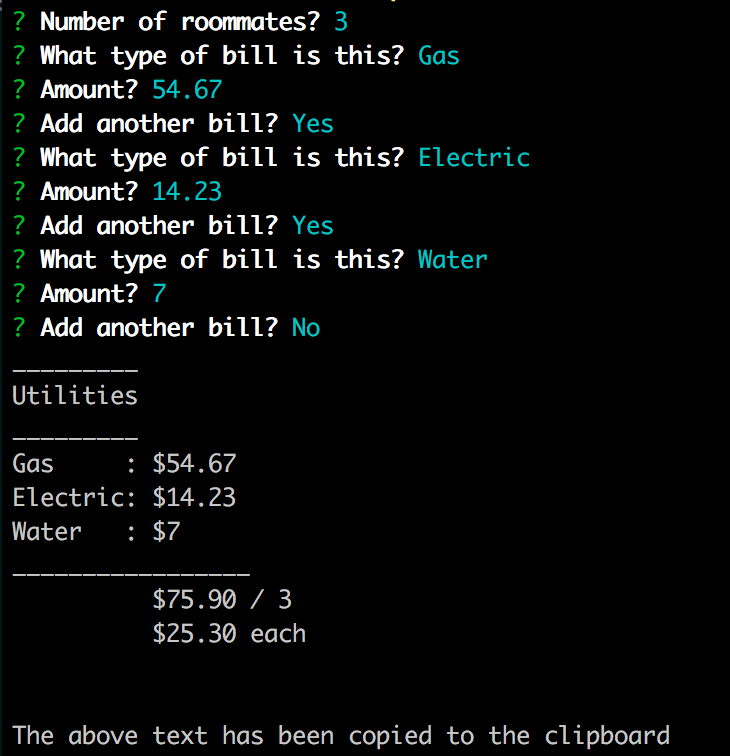

## Utility Calculator

Simple CLI utility for calculating utility bills, displaying a quick report with totals and how much each roommate
owes. The report is copied to the clipboard.

Simply `npm install` and execute `node index.js` to run the program.

## Motivation

Decided to create a simple program, because I got irritated every month when I had to write up a report for utility
bills for my roommates.

## Tests

`npm test`
